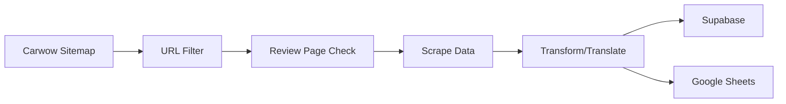

# Carwow Vehicle Data Sync System

英国の自動車情報サイト [Carwow](https://www.carwow.co.uk) から車両カタログデータを自動収集し、Supabase と Google Sheets に同期するシステムです。

## 🚀 Features

- **自動データ収集**: 毎日 JST AM 2:00 に自動実行
- **レビューページ判定**: 車両レビューページのみを対象に収集（リストページを除外）
- **多言語対応**: DeepL API による日本語翻訳
- **デュアル保存**: Supabase（データベース）と Google Sheets（スプレッドシート）に同時保存
- **価格情報**: GBP → JPY 自動換算
- **画像収集**: 車両画像URLを最大20枚まで取得
- **詳細スペック**: ドア数、シート数、駆動方式、寸法等を取得

## 📁 Project Structure

```
.github/workflows/
├── daily_sync.yml          # GitHub Actions ワークフロー

/
├── model_scraper.py        # メイン スクレイピング モジュール
├── scrape.py              # バッチ処理・メインループ
├── transform.py           # データ変換・日本語翻訳
├── gsheets_helper.py      # Google Sheets 連携
├── body_type_mapper.py    # ボディタイプ分類（Selenium）
├── requirements.txt       # Python依存パッケージ
└── README.md             # このファイル
```

## 🔧 Setup

### 1. GitHub Secrets 設定

以下の環境変数を GitHub リポジトリの Secrets に設定:

| Secret Name | Description | Example |
|------------|-------------|---------|
| `SUPABASE_URL` | Supabase プロジェクトURL | `https://xxx.supabase.co` |
| `SUPABASE_KEY` | Supabase APIキー（anon key） | `eyJhbGci...` |
| `DEEPL_KEY` | DeepL API認証キー | `xxxxxxxx-xxxx-xxxx-xxxx-xxxxxxxxxxxx` |
| `GS_CREDS_JSON` | Google サービスアカウントJSON（1行） | `{"type":"service_account",...}` |
| `GS_SHEET_ID` | Google スプレッドシートID | `1ABC...xyz` |
| `GEMINI_API_KEY` | (将来用) Gemini API キー | `AIza...` |

### 2. Google Sheets 準備

1. Google Cloud Console でサービスアカウントを作成
2. Sheets API と Drive API を有効化
3. スプレッドシートを作成し、サービスアカウントに編集権限を付与
4. `system_cars` という名前のシートが自動作成されます

### 3. Supabase テーブル

```sql
CREATE TABLE cars (
  id UUID PRIMARY KEY,
  slug TEXT UNIQUE NOT NULL,
  make_en TEXT,
  model_en TEXT,
  make_ja TEXT,
  model_ja TEXT,
  overview_en TEXT,
  overview_ja TEXT,
  body_type TEXT[],
  body_type_ja TEXT[],
  fuel TEXT,
  price_min_gbp INTEGER,
  price_max_gbp INTEGER,
  price_min_jpy INTEGER,
  price_max_jpy INTEGER,
  spec_json JSONB,
  media_urls TEXT[],
  catalog_url TEXT,
  doors INTEGER,
  seats INTEGER,
  dimensions_mm TEXT,
  drive_type TEXT,
  drive_type_ja TEXT,
  grades TEXT[],
  engines TEXT[],
  colors TEXT[],
  full_model_ja TEXT,
  updated_at TIMESTAMPTZ
);
```

## 🎯 Key Features Explained

### レビューページ判定ロジック

```python
def is_review_page(url: str) -> bool:
    """
    車両レビューページかリストページかを判定
    - レビューページ: car-reviews タブがアクティブ
    - リストページ: automatic, used, deals 等のフィルタページ
    """
```

**判定例**:
- ✅ `https://www.carwow.co.uk/alfa-romeo/junior` → レビューページ
- ❌ `https://www.carwow.co.uk/alpine/automatic` → リストページ（除外）

### 価格取得パターン

1. **中古価格のみ**: `Used: £38,270` → `price_min_gbp` に格納
2. **新車価格範囲**: `RRP £110,960 - £166,425` → 両方に格納

### スペック取得の強化

複数のUIパターンに対応:
- 旧UI: `summary-list__item` 形式
- 新UI: `car-specs__item` 形式  
- フォールバック: 正規表現による抽出

### 将来のGemini API統合準備

```python
# 現在はコメントアウト
# def get_gemini_overview(page_content: str, make: str, model: str) -> str:
#     """Gemini APIで車両概要を生成"""
#     genai.configure(api_key=os.getenv('GEMINI_API_KEY'))
#     ...
```

## 📊 Data Schema

| Field | Type | Description |
|-------|------|-------------|
| `id` | UUID | ユニークID (UUID v5) |
| `slug` | TEXT | URL識別子 (例: `bmw-3-series`) |
| `make_en` | TEXT | メーカー名（英語） |
| `model_en` | TEXT | モデル名（英語） |
| `make_ja` | TEXT | メーカー名（日本語） |
| `model_ja` | TEXT | モデル名（日本語） |
| `overview_en` | TEXT | 概要（英語） |
| `overview_ja` | TEXT | 概要（日本語・DeepL翻訳） |
| `body_type` | TEXT[] | ボディタイプ（英語） |
| `body_type_ja` | TEXT[] | ボディタイプ（日本語） |
| `fuel` | TEXT | 燃料タイプ |
| `price_min_gbp` | INTEGER | 最低価格（GBP） |
| `price_max_gbp` | INTEGER | 最高価格（GBP） |
| `price_min_jpy` | INTEGER | 最低価格（JPY） |
| `price_max_jpy` | INTEGER | 最高価格（JPY） |
| `spec_json` | JSONB | 詳細スペック（JSON） |
| `media_urls` | TEXT[] | 画像URL配列 |
| `doors` | INTEGER | ドア数 |
| `seats` | INTEGER | シート数 |
| `dimensions_mm` | TEXT | 寸法（mm） |
| `drive_type` | TEXT | 駆動方式（Automatic/Manual） |
| `drive_type_ja` | TEXT | 駆動方式（AT/MT） |

## 🚦 Running the System

### 自動実行
- 毎日 JST AM 2:00 (UTC 17:00) に自動実行
- GitHub Actions の schedule trigger を使用

### 手動実行
1. GitHub リポジトリの Actions タブへ
2. "Daily Carwow Sync" ワークフローを選択
3. "Run workflow" ボタンをクリック

### ローカルテスト
```bash
# 環境変数設定
export SUPABASE_URL="https://xxx.supabase.co"
export SUPABASE_KEY="your-key"
export DEEPL_KEY="your-deepl-key"
export DEBUG_MODE="true"  # テストモード（最初の10件のみ）

# 実行
python scrape.py
```

## 📈 Monitoring

### ログ確認
- GitHub Actions の実行ログで詳細を確認
- Artifacts として保存される `crawler-logs-*.zip` をダウンロード

### エラー処理
- 個別のURL処理エラーはスキップして継続
- 全体のエラー率が表示される
- 失敗時は GitHub Actions が failure ステータスになる

## 🔄 Data Flow



## 🐛 Troubleshooting

### よくある問題と解決方法

1. **スプレッドシート更新エラー**
   - サービスアカウントの権限を確認
   - `system_cars` シートが存在するか確認

2. **価格が取得できない**
   - Carwow のHTML構造変更の可能性
   - `_extract_prices()` 関数のセレクタを更新

3. **レビューページ判定の誤り**
   - `is_review_page()` の判定ロジックを確認
   - 新しいURLパターンを `EXCLUDE_KEYWORDS` に追加

4. **DeepL翻訳エラー**
   - APIキーの有効性を確認
   - 月間制限に達していないか確認

## 📝 License

Private repository - All rights reserved

## 👥 Contributors

- YM Works Europe

## 📞 Support

Issues は GitHub Issues で管理してください。
