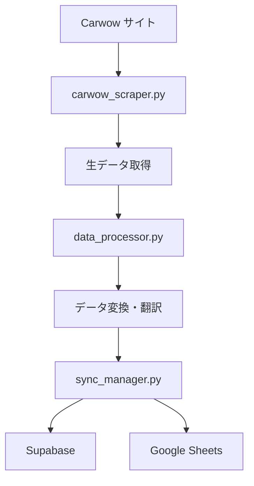

# Carwow Vehicle Data Sync System

英国の自動車情報サイト [Carwow](https://www.carwow.co.uk) から車両データを自動収集し、Supabase と Google Sheets に同期するシステムです。

## 📋 システム構成

シンプルな3ファイル構成で、役割を明確に分離：

```
carwow_scraper.py    # データ取得専門（スクレイピング）
data_processor.py    # データ変換・翻訳処理
sync_manager.py      # 実行管理・DB同期
```

## 🔧 セットアップ

### 1. 環境変数の設定

GitHub Secrets に以下の環境変数を設定：

| 変数名 | 説明 | 例 |
|--------|------|-----|
| `SUPABASE_URL` | Supabase プロジェクトURL | `https://xxx.supabase.co` |
| `SUPABASE_KEY` | Supabase API キー（anon key） | `eyJhbGci...` |
| `DEEPL_KEY` | DeepL API 認証キー（Free版可） | `xxxxxxxx-xxxx-xxxx` |
| `GS_CREDS_JSON` | Google サービスアカウント JSON（1行化） | `{"type":"service_account",...}` |
| `GS_SHEET_ID` | Google スプレッドシートID | `1ABC...xyz` |

### 2. データベース構造

#### Supabase テーブル (cars)

```sql
CREATE TABLE cars (
  id UUID PRIMARY KEY,
  slug TEXT UNIQUE NOT NULL,
  make_en TEXT,
  model_en TEXT,
  make_ja TEXT,
  model_ja TEXT,
  body_type TEXT[],
  body_type_ja TEXT[],
  fuel TEXT,
  price_min_gbp INTEGER,
  price_max_gbp INTEGER,
  price_used_gbp INTEGER,
  price_min_jpy INTEGER,
  price_max_jpy INTEGER,
  price_used_jpy INTEGER,
  overview_en TEXT,
  overview_ja TEXT,
  spec_json JSONB,
  media_urls TEXT[],
  catalog_url TEXT,
  doors INTEGER,
  seats INTEGER,
  dimensions_mm TEXT,
  drive_type TEXT,
  drive_type_ja TEXT,
  grades TEXT[],
  engines TEXT[],
  colors TEXT[],
  full_model_ja TEXT,
  updated_at TIMESTAMPTZ DEFAULT NOW()
);

CREATE INDEX idx_cars_slug ON cars(slug);
CREATE INDEX idx_cars_make ON cars(make_en);
CREATE INDEX idx_cars_updated ON cars(updated_at);
```

#### Google Sheets 構造

自動的に `system_cars` シートが作成され、以下のカラムが設定されます：

| カラム名 | 型 | 説明 |
|---------|-----|------|
| id | TEXT | UUID v5 |
| slug | TEXT | メーカー/モデル形式 |
| make_en | TEXT | メーカー名（英語） |
| model_en | TEXT | モデル名（英語） |
| make_ja | TEXT | メーカー名（日本語） |
| model_ja | TEXT | モデル名（日本語） |
| body_type | JSON | ボディタイプ配列 |
| body_type_ja | JSON | ボディタイプ（日本語） |
| fuel | TEXT | 燃料タイプ |
| price_min_gbp | NUMBER | 最低価格（GBP） |
| price_max_gbp | NUMBER | 最高価格（GBP） |
| price_used_gbp | NUMBER | 中古価格（GBP） |
| price_min_jpy | NUMBER | 最低価格（JPY） |
| price_max_jpy | NUMBER | 最高価格（JPY） |
| price_used_jpy | NUMBER | 中古価格（JPY） |
| overview_en | TEXT | 概要（英語） |
| overview_ja | TEXT | 概要（日本語） |
| spec_json | JSON | 詳細スペック |
| media_urls | JSON | 画像URL配列 |
| catalog_url | TEXT | カタログURL |
| doors | NUMBER | ドア数 |
| seats | NUMBER | シート数 |
| dimensions_mm | TEXT | 寸法 |
| drive_type | TEXT | 駆動方式 |
| drive_type_ja | TEXT | 駆動方式（日本語） |
| grades | JSON | グレード配列 |
| engines | JSON | エンジン配列 |
| colors | JSON | カラー配列 |
| full_model_ja | TEXT | フルモデル名（日本語） |
| updated_at | DATETIME | 更新日時 |

## 🚀 実行方法

### 自動実行
- 毎日 JST AM 2:00 に自動実行（GitHub Actions）
- すべてのメーカー・モデルを処理

### 手動実行

#### GitHub Actions から
1. Actions タブを開く
2. "Daily Carwow Sync" を選択
3. "Run workflow" をクリック
4. オプションを設定（任意）：
   - `makers`: 特定メーカーのみ処理
   - `limit`: 処理数制限
   - `test_mode`: テストモード（5件のみ）

#### コマンドラインから

```bash
# 全データ同期
python sync_manager.py

# テストモード（5件のみ）
python sync_manager.py --test

# 特定メーカーのみ
python sync_manager.py --makers audi bmw

# 特定モデルのみ
python sync_manager.py --models audi/a4 bmw/x5

# 処理数制限
python sync_manager.py --limit 10
```

## 📊 データ取得フロー



## 🔍 スクレイピング詳細

### 対象ページ
- メーカー一覧: `/brands`
- メーカーページ: `/{maker}`
- モデルページ: `/{maker}/{model}`
- スペックページ: `/{maker}/{model}/specifications`
- カラーページ: `/{maker}/{model}/colours`

### データ取得戦略
1. **メーカー自動発見**: /brands ページとトップページから全メーカーを検出
2. **モデル自動発見**: 各メーカーページから全モデルを検出
3. **除外処理**: カテゴリページ、フィルタページ、カラーページを自動除外
4. **ボディタイプ推定**: カテゴリページへの掲載状況から推定

### 取得データ
- 基本情報（メーカー、モデル、概要）
- 価格情報（新車・中古・価格帯）
- スペック（ドア数、シート数、寸法、駆動方式）
- メディア（最大40枚の画像URL）
- バリエーション（カラー、グレード、エンジン）

## ⚠️ トラブルシューティング

### よくある問題

#### スプレッドシート更新エラー
- サービスアカウントの権限を確認
- スプレッドシートIDが正しいか確認
- APIの有効化を確認（Sheets API, Drive API）

#### 価格が取得できない
- Carwowのページ構造変更の可能性
- `_extract_prices` メソッドのセレクタを更新

#### DeepL翻訳エラー
- APIキーの有効性を確認
- 月間制限（Free: 500,000文字）を確認

#### データ取得失敗
- レート制限に達した可能性（待機時間を調整）
- ネットワークエラー（リトライ回数を増やす）

## 🤖 AI向け仕様説明

### アーキテクチャ概要
本システムは3つのモジュールで構成される単純明快な設計：

1. **carwow_scraper.py**: 純粋なデータ取得層。HTTPリクエスト、HTML解析、データ抽出のみを担当
2. **data_processor.py**: ビジネスロジック層。データ変換、翻訳、バリデーションを担当
3. **sync_manager.py**: アプリケーション層。実行制御、データ永続化を担当

### 重要な設計判断
- **関心の分離**: 各モジュールは単一責任を持つ
- **エラー耐性**: 個別のエラーは全体を停止させない
- **拡張性**: 新しいデータソースや保存先を容易に追加可能
- **テスタビリティ**: 各モジュールは独立してテスト可能

### データフロー
```
URL発見 → スクレイピング → 変換 → 検証 → 永続化
```

### 主要クラス
- `CarwowScraper`: メインスクレイピングクラス
- `DataProcessor`: データ変換クラス
- `SyncManager`: 同期管理クラス
- `SupabaseManager`: DB接続管理
- `GoogleSheetsManager`: シート接続管理

### 処理の特徴
- **自動メーカー発見**: ハードコーディングなしで全メーカーを検出
- **自動モデル発見**: 各メーカーの全モデルを動的に検出
- **賢い除外処理**: フィルタページや無関係なページを自動判定
- **多段階価格取得**: 複数の場所から価格情報を取得・統合
- **ボディタイプ推定**: カテゴリページへの掲載状況から推定

### エラーハンドリング
- HTTPエラー: 3回までリトライ
- 解析エラー: スキップして続行
- API制限: 自動待機とレート制限
- 検証エラー: ログ記録してスキップ

### パフォーマンス考慮
- レート制限: 0.5-1.5秒のランダム待機
- バッチ処理: 効率的な一括更新
- タイムアウト: 適切なタイムアウト設定
- メモリ管理: 大量データの逐次処理

## 📝 ライセンス

Private repository - All rights reserved

## 👥 Contributors

YM Works Europe
